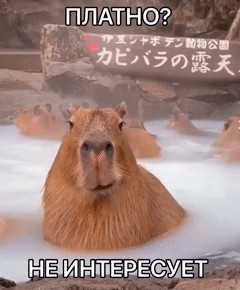

# AndanPerek
Our andan project (๑ᵔ⤙ᵔ๑)

In our project, we collected and parsed a dataset of products from the Perekrestok website. We then cleaned and prepared the data, analyzed it comprehensively, formulated inquiries, validated hypotheses, and finally built a machine learning model to predict prices.

Our focus revolved around the nutritional aspects, composition, and characteristics of food products.